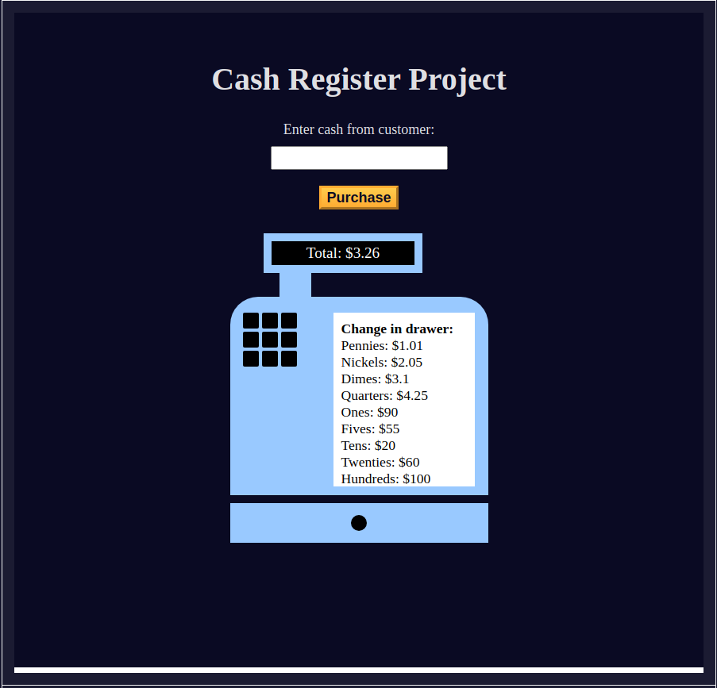

# cash-register

The Cash Register project is a web-based app that simulates a basic cash register system. It's designed to help users manage sales transactions by calculating totals, taxes, and change. This project is a great way to practice HTML, CSS, and JavaScript skills.

I created this as a part of the freecodecamp Javascript course!

## Screenshots

## Features

- Add items with their prices to the transaction.
- Clear the transaction and start a new one.
- Responsive design for use on different devices.
- No real point to this than practice!

## 🔗 Links

